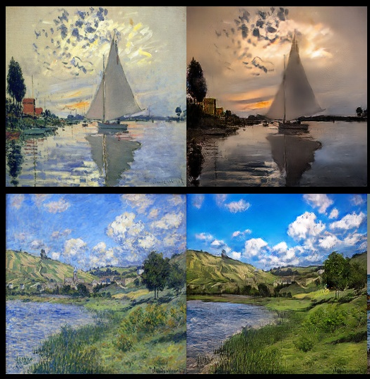
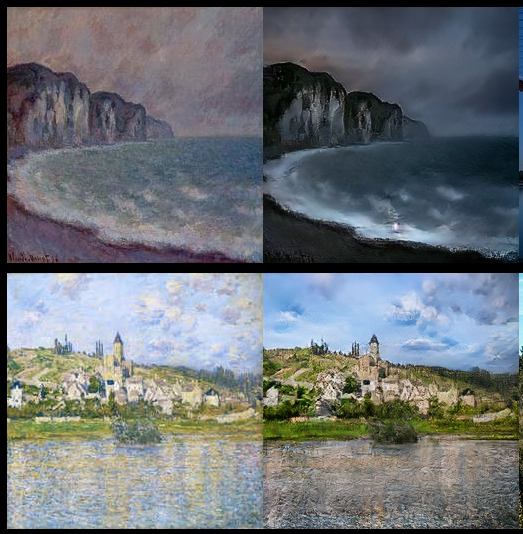
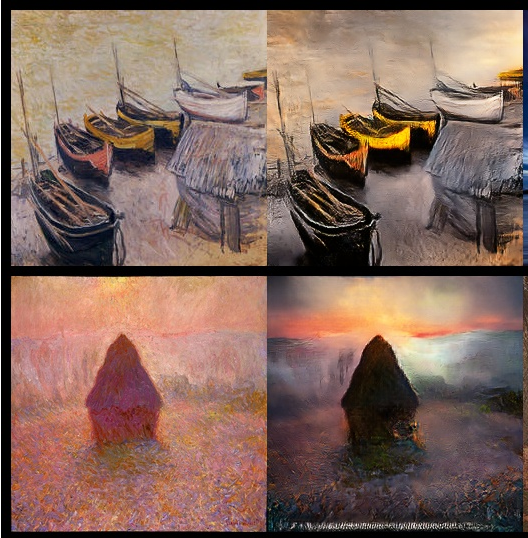
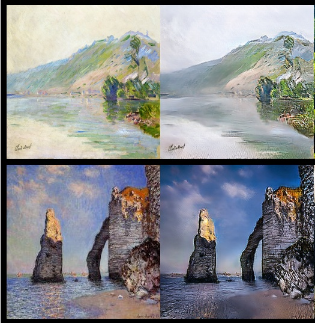

# CYCLE-GAN
This is an implementation of of the paper Unpaired Image-to-Image Translationusing Cycle-Consistent Adversarial Networks

# image to image translation 
<p align="center"> 
  
  <h3 align="center">
    A python script based on cycle_gan for image 2 image translation  
  </h3>  
</p>

---
---
# abstract (paper)

Image-to-image  translation  is  a  class  of  vision  andgraphics problems where the goal is to learn the mappingbetween an input image and an output image using a train-ing set of aligned image pairs.   However,  for many tasks,paired training data will not be available.  We present anapproach for learning to translate an image from a sourcedomainXto a target domainYin the absence of pairedexamples.   Our goal is to learn a mappingG:X→Ysuch that the distribution of images fromG(X)is indistin-guishable from the distributionYusing an adversarial loss.Because this mapping is highly under-constrained, we cou-ple it with an inverse mappingF:Y→Xand introduce acycle consistency lossto enforceF(G(X))≈X(and viceversa).   Qualitative results are presented on several taskswhere paired training data does not exist, including collec-tion  style  transfer,  object  transfiguration,  season  transfer,photo enhancement, etc. Quantitative comparisons againstseveral  prior  methods  demonstrate  the  superiority  of  ourapproach.


# contents
* [structure](#structure)
* [results](#results)
* [prerequisites](#prerequisites)
* [installation](#installation)
* [training](#training)
* [prediction](#searching)


# structure
This project is structured in a modular way
It contains the :
* following directories:
    * models
        * definition of generator structure 
        * definition of discriminator structure
    * libraries
    	* group a set of functionalies such as
    	* image procesing 
    	* path manipulation   
    * optimization 
        * dataholder   
        * history     
        * learning     
    * readme_utils    
        * contains some image, font for readme rendering 
        * can be easily extended by the user 
* following files
        * README.md 
        * .gitignore
        * requirements.txt 

#results


<p align="center"> 
  
  <h3 align="center">
    generator output epoch N°30 
  </h3>  
</p>

<p align="center"> 
  
  <h3 align="center">
    generator output epoch N°40 
  </h3>  
</p>


<p align="center"> 
  
  <h3 align="center">
    generator output epoch N°50 
  </h3>  
</p>

# prerequisites
* git
* curl
* cmake 
* pkg-config 
* libatlas-base-dev 
* libboost-python-dev 
* libopenblas-dev 
* liblapack-dev
* python3
* python3-venv 
* build-essential 

# installation 
```bash
	git clone https://github.com/Milkymap/CYCLE-GAN
	cd CYCLE-GAN
	python -m venv env 
	source env/bin/activate
	pip install -r requirements.txt
```


# training

```python
   python -m optimization.learning 
        --gpu_idx 0 
        --height 256 
        --width 256 
        --source_x0 path to image domain A : => XA 
        --source_x1 path to image domain B : => XB 
        --nb_epochs 0 
        --bt_size 2 
        --no-paired
        --storage path2sample_image
``` 
